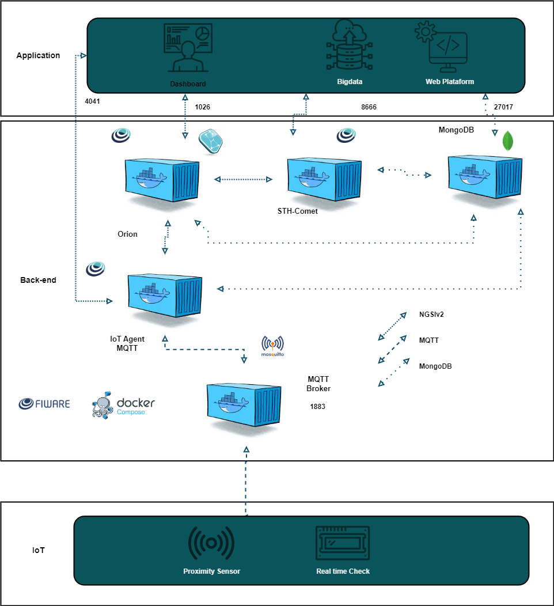

# Near Guard 🏎️
## Descrição 📝
Este projeto consiste na criação de um dispositivo inteligente para medir a distância entre o carro e obstáculos ou oponentes, ajudando pilotos a tomarem decisões mais precisas em ultrapassagens e durante a corrida 🏎️.

O dispositivo mede distâncias em tempo real, exibindo os resultados em uma tela LCD com sugestões claras e imediatas. O objetivo é maximizar a segurança do piloto, minimizar o risco de colisões 💥 e evitar danos ao carro.

### Funcionalidades:
- Se a distância for menor que 1 metro, o display exibe a distância e a mensagem: "MUITO PERTO!" ⚠️
- Se a distância for maior que 1 metro, o display mostra a distância e a mensagem: "BOA DISTÂNCIA!" ✅
- O dispositivo ajuda a tornar ultrapassagens mais certeiras, reduzindo o risco de erro.
- Dashboard em tempo real para análises técnicas

## Tecnologias Utilizadas 💻
- ESP32: Substituímos a placa Arduino por uma ESP32, que oferece mais recursos, incluindo conectividade Wi-Fi.
- Sensor de Proximidade: O sensor HC-SR04 mede distâncias com precisão.
- Display LCD 16x2 com Interface I2C: Mostra a distância medida e mensagens de alerta.
- FIWARE: Plataforma de backend implementada no servidor para gerenciar os dados do sensor.
- Azure: O servidor em nuvem utilizado para hospedar o FIWARE.

## DRAFT DA AQUITETURA
 
 
## Materiais Necessários ⚒️
  ***HARDWARE***
- Placa ESP32
- Sensor de Proximidade HC-SR04
- Display LCD 16x2 com Interface I2C
- Fios jumper
- Protoboard

***SOFTWARE***
- FIWARE Descomplicado => Acesse[aqui](https://github.com/fabiocabrini/fiware) a documentação.
- Plataforma de Cloud (Neste Projeto foi usado **Azure**) 
## Como Construir ⚙️
1. Montagem do Circuito 🧩:
- Conecte o sensor de proximidade HC-SR04 à placa ESP32 conforme o esquema de pinagem do sensor.
- Conecte o display LCD 16x2 com interface I2C à ESP32, seguindo o esquema de pinagem I2C.
- Utilize o site WOKWI para testar a montagem online antes de realizar no hardware físico.

2. Configuração do Ambiente de Desenvolvimento 🛠️:

- Certifique-se de ter as seguintes bibliotecas instaladas no seu ambiente:
- NewPing para o sensor de proximidade.
- LiquidCrystal_I2C para o display LCD.
3. Implementação do Backend no FIWARE 💾:

- Utilize a plataforma FIWARE Descomplicado para configurar o backend.
- O FIWARE, hospedado na Azure, coleta e gerencia os dados enviados pelo sensor de proximidade via MQTT.

4. Integração com a Azure ☁️:
- Configure um servidor na Azure para rodar o FIWARE.
- A ESP32 envia dados para o FIWARE utilizando o protocolo MQTT, onde os dados podem ser monitorados e utilizados em um dashboard para análise em tempo real.
5. Carregamento do Código 💻:
- Abra o [códifo fonte](codigo-fonte.cpp) no seu ambiente de desenvolvimento (como o Arduino IDE ou Wowki para ESP32).
- Verifique se as portas correspondentes estão corretamente configuradas.
- Carregue o código para a ESP32 
6. Execução ▶️:
- Após a montagem e configuração, ligue a ESP32.
- O sensor de proximidade começa a medir a distância e os dados são enviados ao display LCD e ao FIWARE para monitoramento remoto.

### Execução no Servidor:
O FIWARE na Azure pode ser acessado para monitorar e gerenciar os dados de proximidade enviados pela ESP32, com integração ao MQTT para transmissão contínua.

## Links Úteis
- [WOKWI](https://wokwi.com/projects/409862054851292161)
- [Vídeo Explicativo](https://drive.google.com/file/d/1Knn8ppdBQ6mKsoJgNswNgvoh_FNgE-sx/view?usp=sharing)

## Autores
- [Giulia Barbizan](https://github.com/Giulia-Rocha) RM:558084
- [Felipe Marques](https://github.com/FelipeMarquesdeOliveira) RM:556319
- [Gustavo Viega](https://github.com/Vieg4) RM:555885

